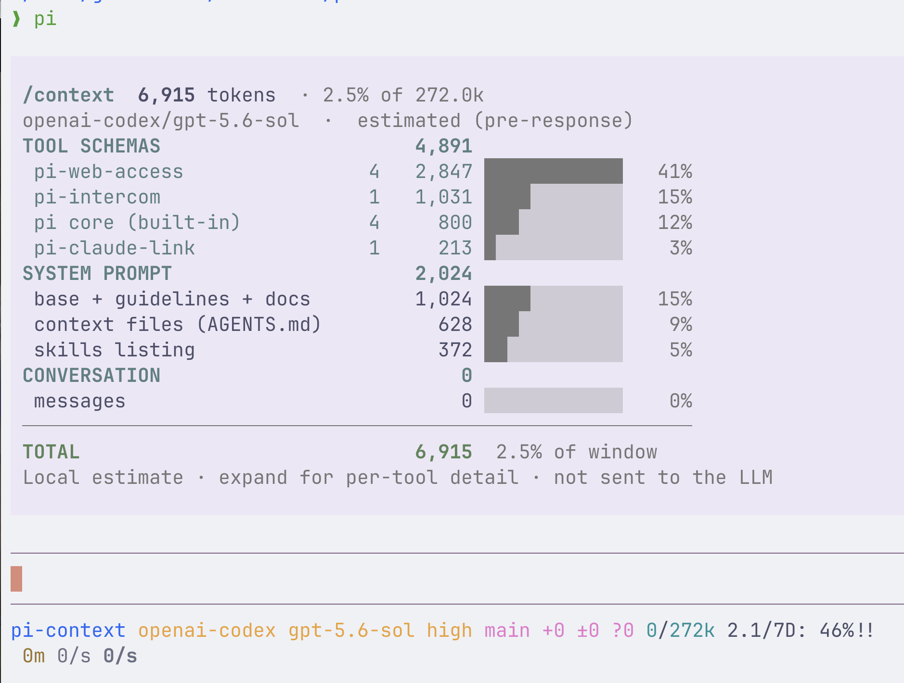

# pi-context

A `/context` command for [pi](https://github.com/earendil-works/pi-coding-agent) — like Claude Code's `/context`, but for pi.



pi's footer shows *one* aggregate token number. `pi-context` breaks that number down so you can see **what is actually consuming your context window**:

- **Tool schemas**, grouped by the extension/package that registered them (usually the #1 consumer)
- **System prompt** text (base prompt + guidelines + tool one-liners + pi docs)
- **Context files** (`AGENTS.md` / `CLAUDE.md`), per file when expanded
- **Skills** listing, per skill when expanded
- **Conversation** (messages)

The report renders inline in the transcript and is **never sent to the LLM**, so running it costs you nothing.

## Example

```
/context  31,507 tokens  · 15.8% of 200.0k
github-copilot/claude-opus-4.8  ·  calibrated to measured total

TOOL SCHEMAS                     26,015
  pi-background-tasks       11   7,480 ████████████  24%
  pi-hermes-memory           6   5,929 █████████░░░  19%
  pi-web-access              4   4,198 ██████░░░░░░  13%
  ...
SYSTEM PROMPT                     4,192
  base + guidelines + docs         2,232 ███░░░░░░░░░   7%
  context files              1     1,107 █░░░░░░░░░░░   4%
  skills listing            23       853 █░░░░░░░░░░░   3%
CONVERSATION                      1,300
  messages                         1,300 █░░░░░░░░░░░   4%
──────────────────────────────────────────────────────────
TOTAL                            31,507  15.8% of window
```

Press **`Ctrl+O`** (pi's tool-output expand toggle) to expand the report; `Ctrl+O` again collapses it. Expanded adds:

- a **per-tool** breakdown inside each extension group
- a **per-skill** breakdown of the skills listing (with the plugin/package each skill came from)
- a **per-file** breakdown of context files
- the **extensions that are loaded but cost zero context** — the ones registering only commands, hooks, or renderers and no tool schemas (with their command counts)

```
 skills listing              23   2,937 ████████████   47%
   review-pr · pr-review            159 █░░░░░░░░░░░    3%
   agent-desktop                    154 █░░░░░░░░░░░    2%
   terminal-browser · agents        142 █░░░░░░░░░░░    2%
   ...
 other extensions loaded (no tool schemas, 0 tokens):
   color (1), footer (3), sc (1), session-scheduler (2)
```

## Install

```bash
pi install git:github.com/ericboehs/pi-context
```

Then run `/context` in any session. Update later with:

```bash
pi update git:github.com/ericboehs/pi-context
```

Or load it locally for a quick try without installing:

```bash
pi -e /path/to/pi-context/index.ts
```

## How token counts are computed

pi-context reports three levels of accuracy, shown in the report header:

1. **`calibrated to measured total`** — pi has a live measured context total (`ctx.getContextUsage()`), so every section is scaled to reconcile *exactly* to it. This is the normal case once the model has responded at least once.
2. **`estimated (saved calibration for this model)`** — before the first response, pi-context reuses the scale it learned from a previous measured session with the *same* model. Because Claude and GPT tokenizers differ substantially, this per-model learning keeps the pre-response estimate close (typically within a few percent).
3. **`estimated (pre-response)`** — a model you've never measured before. Falls back to a neutral character÷token estimate (prose ≈ 3.6, JSON ≈ 3.0) until the first response teaches it that model's scale.

Learned scales are cached in `~/.pi-context/calibration.json` (keyed by `provider/model`, exponentially smoothed). Delete that file to reset.

Tune the base divisors for an unseen provider/tokenizer if you like (lower = more tokens per character):

```bash
PI_CONTEXT_CPT_PROSE=3.6 PI_CONTEXT_CPT_JSON=3.0 pi
```

Only **active** tools are counted (the ones actually sent to the model), so disabling tools with `--exclude-tools` / `--tools` is reflected immediately.

Extension groups are named after the package that registered them (`npm:`/`git:` sources). Loose extension files — the ones pi discovers in `~/.pi/agent/extensions/` — are named after their file, so each one gets its own row instead of all collapsing into a single `auto` group.

## Why this is useful

Extensions are convenient, but each one ships tool schemas that live in *every* request. It's easy to accumulate 20–30 tools and quietly spend 25k+ tokens of context before you type anything. `/context` shows you exactly which extensions cost the most, so you can decide what to keep, trim (`--exclude-tools`), or uninstall.

## Development

The package declares no dependencies, so that `pi install` does not clone a copy
of pi into `~/.pi/agent/git` behind it. Fetch the types on demand to typecheck:

```bash
npm install --no-save typescript@5 @earendil-works/pi-coding-agent @earendil-works/pi-tui
npm run typecheck
```

## License

MIT
